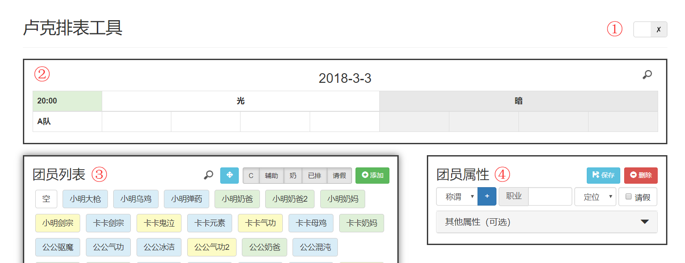

# luke_schedule
Authorized to 神のPY

## Quick Start

1. 表格编辑锁，在编辑表格结构时需要先解锁。（锁只是为了截图的时候好看一点，隐藏掉+-按钮，并不影响排表）

2. 排表区，将团员直接拖入表格单元格即可排表。

3. 团员列表

    - 按住锚点可以拖动面板。
    - 点击筛选按钮可以隐藏/显示对应分类的团员(目前【已排】有BUG，请保持点击状态）。
    - 点击添加可以新增一个空白团员。

4. 团员属性

    - 先在左侧团员列表选中一个团员，然后可在右侧编辑该团员的属性，编辑完成后请点击保存。
    - 可选属性只是占位用，以后可能考虑自动排表使用，无影响。
    - 称谓是团员的昵称，建议2个中文字左右，这是排重的关键，在添加前请确认是否已存在。
    - 职业请填写简称，建议3个中文字以内。

