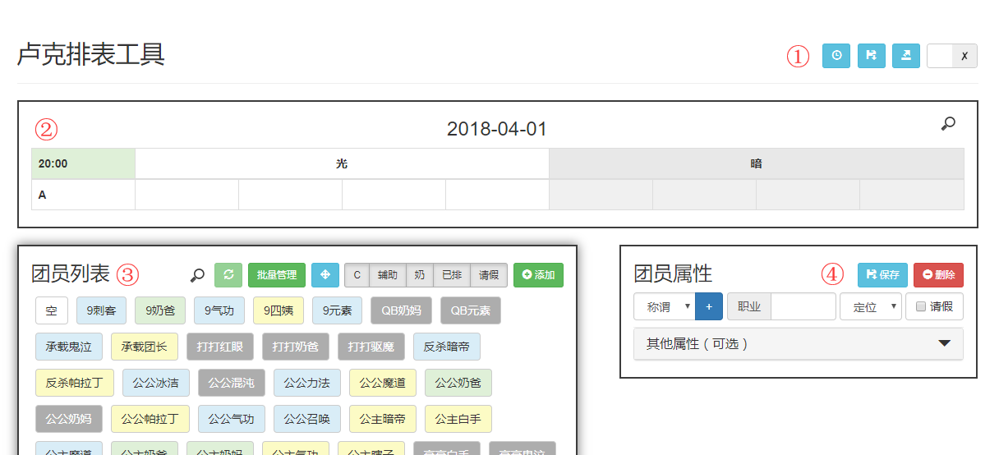

# luke_schedule
Authorized to 神のPY

## Brief Introduction

1. 表格编辑锁。

    - 在编辑表格结构时需要先解锁。（锁只是为了截图的时候好看一点，隐藏掉+-按钮，**不影响排表**）

2. 排表区。

    - 将团员直接拖入表格单元格即可排表。
    - 点击右上角查找按钮，可以高亮团员。

3. 团员列表

    - **强烈建议留一个\[空\]团员用来占位**
    - 点击查找按钮，可以查找筛选团员。
    - 按住锚点可以拖动面板。
    - 点击筛选按钮可以隐藏/显示对应分类的团员。
    - 点击添加可以新增一个空白团员。
    - 目前没有【酱油】定位，暂用【辅助】代替，后续看需要增设。

4. 团员属性

    - 先在左侧团员列表选中一个团员，然后可在右侧编辑该团员的属性，编辑完成后**请点击保存**。
    - 可选属性只是占位用，以后可能考虑自动排表使用，无影响。
    - 称谓是团员的昵称，建议2个中文字左右，这是**排重的关键**，在添加前请确认是否已存在。
    - 职业请填写简称，建议3个中文字以内。

## Update Plan

- [x] 增加搜索框。团员列表区和排表区。(Update 2018-03-03)
- [x] 增加授权码。在进入页面时就需要填写，填写后拥有提交修改的权限，否则所做更改不会持久化保存。(Update 2018-03-03)
- [ ] 增加设置。可设置首团时间、每团间隔。
- [ ] 增加排表历史。可以将某个历史排表载入到当前排表中。
- [ ] 导出排表结果成图片。可以复制。

## Update History

- 2018-03-06: 修复一个BUG，该BUG导致删除团员时，该团员后的人排表会报603 error。
- 2018-03-05: 修复【已排】BUG，已经可以正常使用了。
- 2018-03-03: 增加了搜索框和授权码。